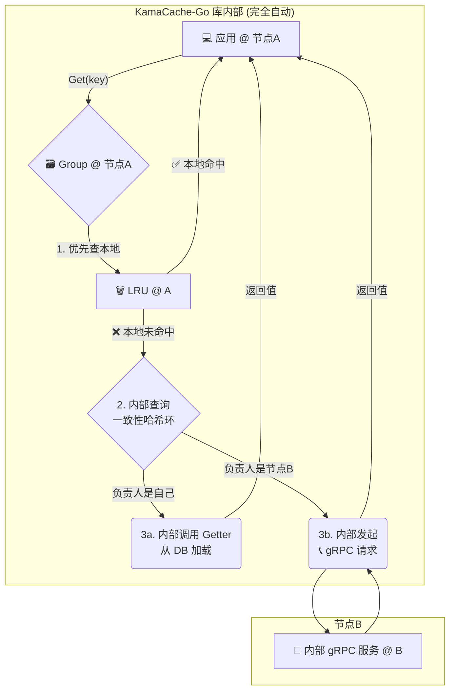

# KamaCache-Go: 分布式缓存架构与使用指南 🚀

## 1.0 概述 🌟

**KamaCache-Go** 是一个 “开箱即用” 的高性能、分布式 Go 内存缓存库。它将复杂的分布式逻辑（如节点发现、gRPC通信、一致性哈希）完全封装，为开发者提供了一个极其简洁的 API。你只需几行代码，就能将你的单机应用缓存无缝升级为强大的分布式缓存集群。

**核心特性:**

*   **⚡ 极致易用**: 高度封装的 API，隐藏所有分布式细节。
*   **🌐 分布式集群**: 通过 gRPC 实现了高效、低延迟的对等节点（Peer-to-Peer）通信。
*   **⚖️ 智能路由**: 内置一致性哈希，自动将缓存数据分布到最合适的节点。
*   **🛡️ 自动容错**: 单个节点宕机不会影响整个集群，仅部分数据需要重新加载。
*   **🗑️ LRU 淘汰**: 采用 LRU 策略自动管理内存，保持高命中率。

## 2.0 架构与调用流程 🏛️

尽管实现细节被封装，但理解其高层工作原理有助于你更好地使用它。

### 2.1 🏠 单实例模式

当你的应用只启动一个节点时，KamaCache-Go 会自动以单实例模式运行，所有操作都在本地内存完成，无任何网络开销。

**调用流程图:**
```mermaid
graph TD
    A[💻 你的应用] -- Get("my_key") --> B{🗃️ Cache Group};
    subgraph "KamaCache-Go 实例"
        B -- 1. 查本地缓存 --> C[🗑️ LRU Cache];
        C -- ✅ 命中 --> D[返回值];
        C -- ❌ 未命中 --> E{2. 调用 Getter};
        E -- 从数据源获取 --> F[🗄️ 数据库/API];
        F -- 返回数据 --> E;
        E -- 3. 填充缓存 --> C;
        E -- 返回数据 --> D;
    end
    D --> A;
```

### 2.2 🌐 分布式集群模式

当你启动多个配置了相同对等节点列表的实例时，它们会自动组成一个集群。**所有复杂的 gRPC 通信和节点查找都在库内部自动完成**。

#### **Get(key) 读取流程**

对你的应用代码来说，调用方式与单实例模式**完全一样**，但其内部的调用流程却大不相同。

1.  你的应用在**节点A**上调用 `group.Get("some_key")`。
2.  KamaCache-Go **优先检查节点A的本地缓存**。如果命中，立即返回。
3.  如果本地未命中，KamaCache-Go 会**自动查询内置的一致性哈希环**。
4.  **情况一：哈希环指示 `some_key` 就应该存放在节点A**。库会自动调用你提供的 `Getter` 从数据库加载数据，存入节点A的本地缓存后返回。
5.  **情况二：哈希环指示 `some_key` 存放在远程的节点B**。KamaCache-Go 会**自动向节点B发起一个内部的 gRPC 请求**，获取数据后返回给你的应用。

**调用流程图:**


#### **Set(key, value) 写入流程**

与读取流程一样，`Set` 方法也会自动将数据写入正确的节点。

1.  你的应用在**节点A**上调用 `group.Set("some_key", "value")`。
2.  KamaCache-Go **自动查询一致性哈希环**，定位到负责 `some_key` 的节点（可能是节点A自己，也可能是远程的节点B）。
3.  库**自动将数据**通过内存写入或内部 gRPC 请求，**存放到正确的节点**上。

> ✨ **核心价值**: 你的业务代码无需关心数据到底存在哪个节点，也无需手动编写任何网络通信代码。只需像操作一个本地 Map 一样操作 `Group` 对象即可。

## 3.0 快速开始指南 🚀

下面我们来实际操作，搭建一个三节点的分布式缓存集群。

### **第 1 步: 初始化项目并获取依赖** ✅

```bash
# 创建项目目录
mkdir my-cluster-app
cd my-cluster-app

# 初始化 Go Module
go mod init my-cluster-app

# 获取 KamaCache-Go 库 (请替换为你的实际库路径)
go get github.com/rson9/KamaCache-Go 
```

### **第 2 步: 编写启动代码 (`main.go`)** ✍️

这是唯一需要你编写的文件。你只需要做三件事：
1.  定义集群中有哪些节点。
2.  创建一个或多个缓存组 (`Group`)，并提供数据源回源逻辑 (`Getter`)。
3.  调用 KamaCache-Go 的启动函数。

```go
package main

import (
	"flag"
	"fmt"
	"log"
	"net/http"
	kamacache "github.com/rson9/KamaCache-Go" 
)

// 1. 模拟后端数据库
var db = map[string]string{
	"Tom":   "630",
	"Jack":  "589",
	"Sam":   "567",
	"Peter": "999",
}

func main() {
	// 2. 定义命令行参数，用于区分不同节点
	var port int
	var isApiServer bool
	flag.IntVar(&port, "port", 8001, "KamaCache node's communication port")
	flag.BoolVar(&api, "api", false, "Set to true to start a public API server on this node")
	flag.Parse()

	// 3. 定义集群所有节点的地址
	//    在生产环境中，这应该来自配置中心或服务发现
	peers := []string{
		"localhost:8001",
		"localhost:8002",
		"localhost:8003",
	}
	selfAddr := fmt.Sprintf("localhost:%d", port)

	// 4. 创建一个缓存组 (Group)
	scoresGroup := kamacache.NewGroup("scores", 2<<10, kamacache.GetterFunc(
		func(key string) ([]byte, error) {
			log.Printf("[SlowDB] Searching for key: %s", key)
			if val, ok := db[key]; ok {
				return []byte(val), nil
			}
			return nil, fmt.Errorf("key %s not found", key)
		},
	))

	// 5. 如果是 API 节点，启动一个对外的 HTTP 服务方便测试
	if isApiServer {
		go startAPIServer("9999", scoresGroup)
	}

	// 6. ✨ 启动集群节点！✨
	//    这是最关键的一步，KamaCache-Go 会在此处启动 gRPC 服务并管理对等节点连接。
	//    这是一个阻塞函数，它会一直运行。
	log.Printf("KamaCache-Go node is running at %s", selfAddr)
	node, err := kamacache.NewNode(selfAddr, peers)
	if err != nil {
		log.Fatalf("Failed to create node: %v", err)
	}
	node.RegisterGroup(scoresGroup) // 将我们创建的 group 注册到节点
	if err := node.Start(); err != nil {
		log.Fatalf("Failed to start node: %v", err)
	}
}

// startAPIServer 是一个简单的 HTTP 服务器，用于从外部访问缓存
func startAPIServer(apiAddr string, group *kamacache.Group) {
	http.HandleFunc("/api", func(w http.ResponseWriter, r *http.Request) {
		key := r.URL.Query().Get("key")
		view, err := group.Get(key)
		if err != nil {
			http.Error(w, err.Error(), http.StatusNotFound)
			return
		}
		w.Header().Set("Content-Type", "application/octet-stream")
		w.Write(view.ByteSlice())
	})
	log.Println("Public API server is running at", apiAddr)
	http.ListenAndServe(apiAddr, nil)
}
```
*(注: 以上 `kamacache.NewNode`, `node.RegisterGroup`, `node.Start` 是基于优秀库设计模式的推断，请根据你的实际 API 进行调整。)*

### **第 3 步: 启动并运行集群** 💨

打开 **3个** 独立的终端窗口，分别启动三个节点。我们将 Node 1 作为对外提供 API 服务的入口。

*   **终端 1 (API & 节点1):**
    ```bash
    go run main.go --port=8001 --api=true
    ```
*   **终端 2 (节点2):**
    ```bash
    go run main.go --port=8002
    ```
*   **终端 3 (节点3):**
    ```bash
    go run main.go --port=8003
    ```

### **第 4 步: 见证奇迹** ✨

集群已在运行！现在打开**第 4 个终端**，使用 `curl` 进行测试：

1.  **第一次请求 `Tom`:**
    ```bash
    curl "http://localhost:9999/api?key=Tom"
    ```
  *   **现象**: 在某个节点的终端（如节点1）会打印 `[SlowDB] Searching for key: Tom`。


2.  **再次请求 `Tom`:**
    ```bash
    curl "http://localhost:9999/api?key=Tom"
    ```
  *   **现象**: **所有节点**的终端都**没有任何日志**。数据已从缓存中快速返回！


3.  **请求 `Peter` (一个可能在其他节点上的键):**
    ```bash
    curl "http://localhost:9999/api?key=Peter"
    ```
  *   **现象**: 你会看到**另一个节点**（如节点2或3）的终端打印了 `[SlowDB]` 日志。API 服务（节点1）通过内部的 gRPC 通信，透明地从负责该键的节点获取了数据。

你成功了！你已经用一个非常简单的 `main.go` 文件，启动并验证了一个全功能的分布式缓存集群。

## 4.0 部署与最佳实践 💡

*   **容器化**: 强烈建议使用 Docker 将应用打包，并通过 Kubernetes 或 Docker Compose 进行部署和管理。
*   **服务发现**: 在生产环境中，应通过配置中心（如 Nacos, Etcd）或K8s的服务发现机制来动态管理 `peers` 列表，而不是硬编码。
*   **网络**: 将所有缓存节点部署在同一个低延迟的内网环境（如 AWS VPC 或阿里云 VPC）中，以获得最佳性能。
*   **监控**: 监控节点的 CPU、内存使用情况，以及缓存的命中率、Get/Set 次数等关键指标。