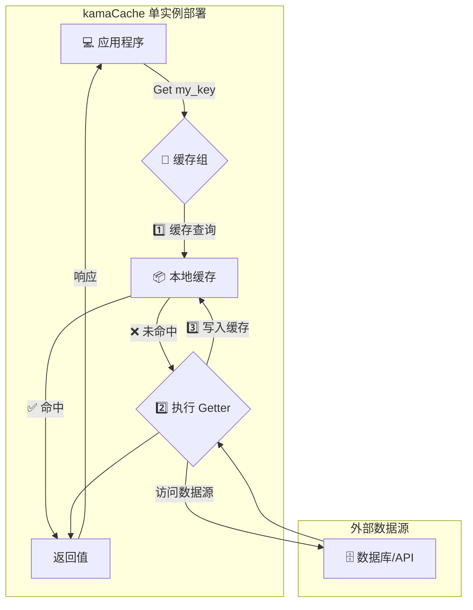
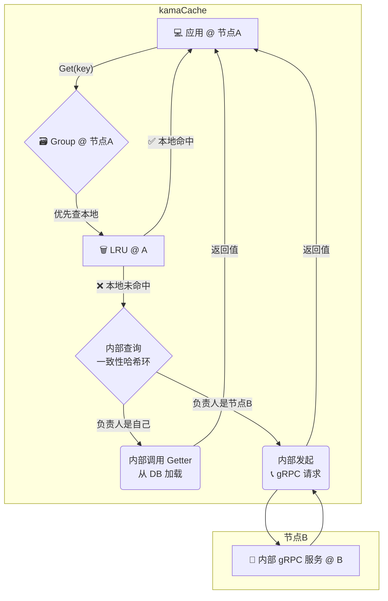

# kamaCache: 分布式缓存架构与使用指南 🚀

## 1.0 概述 🌟

**kamaCache** 是一个 “开箱即用” 的高性能、分布式 Go 内存缓存库。它将复杂的分布式逻辑（如节点发现、gRPC通信、一致性哈希）完全封装，为开发者提供了一个极其简洁的 API。你只需几行代码，就能将你的单机应用缓存无缝升级为强大的分布式缓存集群。

**核心特性:**

*   **⚡ 极致易用**: API 高度封装，调用 `Get()` 即可，完全屏蔽底层分布式细节。
*   **🌐 高效集群**: 节点间通过 **gRPC** 进行 P2P 通信，实现低延迟、高吞吐的数据交换。
*   **⚖️ 智能路由**: 内置**一致性哈希**，自动将 Key 定位到最优节点，并在节点变化时最小化缓存迁移。
*   **🛡️ 自动容错**: 去中心化架构，无单点故障。单个节点宕机，集群服务不中断，仅影响该节点数据。
*   **🗑️ 智能淘汰**:
    *   **LRU**: 内置默认的 LRU 策略，高效管理内存。
    *   **2Q 算法**: 提供可选的 2Q 策略，能有效防止批量数据访问造成的“缓存污染”，提高复杂场景下的命中率。
*   **🔧 灵活可配**: 支持**可插拔的哈希函数**（如 Murmur3, CRC32），允许用户根据业务场景进行性能微调。

## 2.0 架构与调用流程 🏛️

尽管实现细节被封装，但理解其高层工作原理有助于你更好地使用它。

### 2.1 🏠 单实例模式

当你的应用只启动一个节点时，kamaCache 会自动以单实例模式运行，所有操作都在本地内存完成，无任何网络开销。

**调用流程图:**


### 2.2 🌐 分布式集群模式

当你启动多个配置了相同对等节点列表的实例时，它们会自动组成一个集群。**所有复杂的 gRPC 通信和节点查找都在库内部自动完成**。

#### **Get(key) 读取流程**

对你的应用代码来说，调用方式与单实例模式**完全一样**，但其内部的调用流程却大不相同。

1.  你的应用在**节点A**上调用 `group.Get("some_key")`。
2.  kamaCache **优先检查节点A的本地缓存**。如果命中，立即返回。
3.  如果本地未命中，kamaCache 会**自动查询内置的一致性哈希环**。
4.  **情况一：哈希环指示 `some_key` 就应该存放在节点A**。库会自动调用你提供的 `Getter` 从数据库加载数据，存入节点A的本地缓存后返回。
5.  **情况二：哈希环指示 `some_key` 存放在远程的节点B**。kamaCache 会**自动向节点B发起一个内部的 gRPC 请求**，获取数据后返回给你的应用。

**调用流程图:**


#### **Set(key, value) 写入流程**

与读取流程一样，`Set` 方法也会自动将数据写入正确的节点。

1.  你的应用在**节点A**上调用 `group.Set("some_key", "value")`。
2.  kamaCache **自动查询一致性哈希环**，定位到负责 `some_key` 的节点（可能是节点A自己，也可能是远程的节点B）。
3.  库**自动将数据**通过内存写入或内部 gRPC 请求，**存放到正确的节点**上。

> ✨ **核心价值**: 你的业务代码无需关心数据到底存在哪个节点，也无需手动编写任何网络通信代码。只需像操作一个本地 Map 一样操作 `Group` 对象即可。

## 3.0 快速开始指南 🚀

我们将实际操作，搭建一个支持多 Group、可动态创建、带 HTTP 接口的本地缓存服务。


### ✅ 适用范围

> 当前示例仅支持 **本地运行模式**，不依赖网络分布式环境，适合本地开发调试。未来版本将提供自动封装的分布式部署方式。


### **第 1 步: 初始化项目并获取依赖** ✅

```bash
# 创建项目目录
mkdir my-cluster-app
cd my-cluster-app

# 初始化 Go Module
go mod init my-cluster-app

# 获取 kamaCache 库
go get github.com/rson9/kamaCache 
```

### **第 2 步: 编写启动代码 (`main.go`)** ✍️

这是你唯一需要编写的文件。你只需要做三件事：

1. 创建一个或多个缓存组 (`Group`)，并提供回源逻辑 (`Getter`)。
2. 启动 HTTP 服务，支持通过 URL 操作缓存。
3. 运行服务，享受本地高性能缓存。

```go
package main

import (
	"context"
	"fmt"
	"log"
	"net/http"
	"sync"

	kamacache "github.com/rson9/kamaCache/group"
)

// CacheManager 支持多个 Group，且支持 Set 和 Get 操作
type CacheManager struct {
	mu     sync.RWMutex
	groups map[string]*kamacache.Group
}

func NewCacheManager() *CacheManager {
	return &CacheManager{
		groups: make(map[string]*kamacache.Group),
	}
}

func (cm *CacheManager) AddGroup(name string, cacheBytes int64, getter kamacache.Getter) error {
	cm.mu.Lock()
	defer cm.mu.Unlock()

	if _, exists := cm.groups[name]; exists {
		return fmt.Errorf("group %s 已存在", name)
	}
	group := kamacache.NewGroup(name, cacheBytes, getter)
	cm.groups[name] = group
	log.Printf("新增缓存组: %s, 缓存大小: %d 字节", name, cacheBytes)
	return nil
}

func (cm *CacheManager) GetGroup(name string) (*kamacache.Group, bool) {
	cm.mu.RLock()
	defer cm.mu.RUnlock()
	group, ok := cm.groups[name]
	return group, ok
}

func main() {
	cm := NewCacheManager()

	// 创建一个示例缓存组
	_ = cm.AddGroup("scores", 2<<20, kamacache.GetterFunc(
		func(ctx context.Context, key string) ([]byte, error) {
			log.Printf("[Getter-scores] 加载 key: %s", key)
			return []byte("score_for_" + key), nil
		}))

	// HTTP 接口支持 GET / SET 操作
	http.HandleFunc("/cache", func(w http.ResponseWriter, r *http.Request) {
		groupName := r.URL.Query().Get("group")
		key := r.URL.Query().Get("key")
		op := r.URL.Query().Get("op") // get 或 set
		value := r.URL.Query().Get("value")

		group, ok := cm.GetGroup(groupName)
		if !ok {
			http.Error(w, "group 不存在", http.StatusBadRequest)
			return
		}

		switch op {
		case "get":
			view, ok := group.Get(context.Background(), key)
			if !ok {
				http.Error(w, "key 未命中或加载失败", http.StatusNotFound)
				return
			}
			w.Header().Set("Content-Type", "application/octet-stream")
			w.Write(view.ByteSlice())
		case "set":
			err := group.Set(context.Background(), key, []byte(value))
			if err != nil {
				http.Error(w, "Set 失败: "+err.Error(), http.StatusInternalServerError)
				return
			}
			fmt.Fprintf(w, "Set 成功，key=%s, value=%s\n", key, value)
		default:
			http.Error(w, "不支持的操作，请使用 op=get 或 op=set", http.StatusBadRequest)
		}
	})

	log.Println("🟢 本地缓存服务启动成功，监听地址: http://localhost:9999")
	log.Fatal(http.ListenAndServe(":9999", nil))
}
```


### **第 3 步: 运行服务并验证** 💨

```bash
go run main.go
```


### **第 4 步: 使用 curl 验证缓存操作** 🧪

#### ✅ 设置一个缓存值

```bash
curl "http://localhost:9999/cache?group=scores&op=set&key=Tom&value=700"
```
> ✅ 输出: `Set 成功，key=Tom, value=700`


#### ✅ 读取一个缓存值

```bash
curl "http://localhost:9999/cache?group=scores&op=get&key=Tom"
```
> ✅ 输出: `700`


#### ✅ 测试自动回源 Getter

```bash
curl "http://localhost:9999/cache?group=scores&op=get&key=Jerry"
```

> ✅ 输出: `score_for_Jerry`（命中 getter）


### 📦 当前运行模式说明

* 本示例运行在 **本地缓存模式**
* 适用于学习、开发和调试场景
* 后续将扩展支持 **Etcd 注册**、**多节点部署**、**自动服务发现**


## 4.0 部署与最佳实践 💡

*   **容器化**: 强烈建议使用 Docker 将应用打包，并通过 Kubernetes 或 Docker Compose 进行部署和管理。
*   **服务发现**: 在生产环境中，应通过配置中心（如 Nacos, Etcd）或K8s的服务发现机制来动态管理 `peers` 列表，而不是硬编码。
*   **网络**: 将所有缓存节点部署在同一个低延迟的内网环境（如 AWS VPC 或阿里云 VPC）中，以获得最佳性能。
*   **监控**: 监控节点的 CPU、内存使用情况，以及缓存的命中率、Get/Set 次数等关键指标。

## 5.0 当前功能概览与路线图📘 

### ✅ 已实现功能

| 模块                          | 描述                                           |
| --------------------------- | -------------------------------------------- |
| 🧠 **本地缓存 (Local Cache)**   | 提供纯内存高性能缓存，支持 LRU 与 LRU2 替换策略，灵活设置容量         |
| 🔁 **多种 LRU 算法实现**          | 支持标准 LRU、TwoQueue (LRU2)、Clock-LRU 等实现，可自由扩展 |
| 🧰 **多缓存组支持 (Multi-Group)** | 支持一个服务中创建多个缓存 Group，缓存空间隔离，支持动态注册、运行时创建      |
| 🪢 **分布式节点通信**              | 使用 gRPC 实现高性能对等节点通信，支持远程拉取 / 回源 / 路由         |
| 🌐 **一致性哈希算法**              | 内置一致性哈希（支持多个 hash 函数），实现分布式数据负载均衡，支持虚拟节点数配置  |
| 📡 **服务发现与注册 (Etcd)**       | 可选集成 Etcd，自动注册服务并发现其它节点，支持用户名/密码、连接超时等配置     |
| 📈 **缓存统计信息**               | 每个 Group 支持缓存命中率、淘汰次数、回源次数、远程请求等详细指标输出       |


### 🚧 规划中功能（开发中 / 排期中）

| 模块                          | 描述                                                                  |
| --------------------------- | ------------------------------------------------------------------- |
| 🧩 **服务封装简化 (Builder API)** | 提供统一启动函数（如 `StartServerWithGroups`），自动完成 Group 注册、Peer Picker 配置等逻辑 |
| 🎛️ **配置友好化 (YAML/TOML)**   | 提供 YAML / JSON / TOML 配置文件加载，降低部署门槛，支持配置缓存策略、组定义、etcd 参数等           |
| 🧭 **动态策略热更新**              | 支持运行时修改 Group 策略（如 LRU -> LRU2），缓存策略更灵活                             |
| ☁️ **容器化部署与 K8s 支持**        | 提供官方 Dockerfile 与 Helm Chart，快速部署至生产环境                              |
| 🔐 **权限控制与认证机制**            | 支持 HTTP/gRPC 认证鉴权，保障分布式通信安全                                         |
| 🧪 **插件式扩展点**               | 用户可注入自定义淘汰策略、Hash 算法、压缩、序列化器等，提升系统可扩展性                              |
| 🛠️ **控制面 CLI / Dashboard** | 提供命令行和 Web UI 用于实时查看节点状态、缓存状态、配置管理等                                 |
| 📦 **多级缓存结构**               | 支持本地 L1 缓存 + 远程 L2 分布式缓存 + 回源 L3（数据库）的完整链路                          |


### 📣 我们欢迎反馈！

如果你：

* 遇到问题 ❗
* 有想法 💡
* 想一起参与开发 🛠️

欢迎创建 Issue、PR 或邮件联系我们！

📍 GitHub: [https://github.com/rson9/kamaCache](https://github.com/rson9/kamaCache)
📧 Email: *[1302018451@qq.com](mailto:1302018451@qq.com)*
